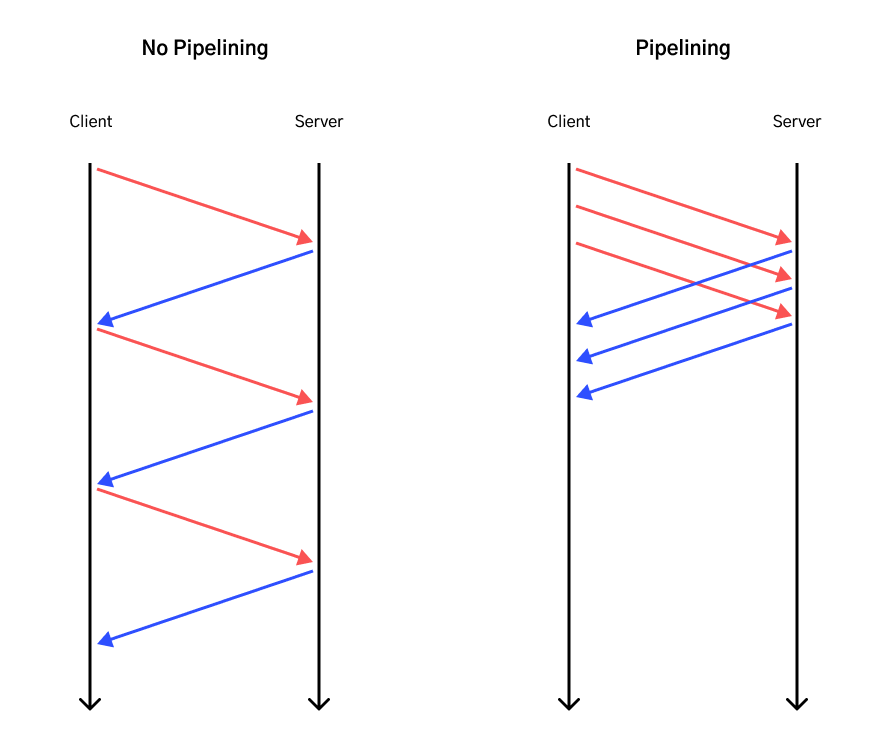
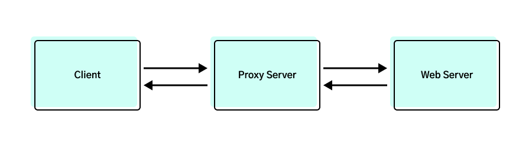

# Computer Networking: A Top Down Approach

[[toc]]

## The Web and HTTP

### HTTP Protocol

The HTTP protocol (application layer) works on top of the TCP protocol (Transport Layer). Characteristics of TCP protocol:

- Ensures reliable data transfer
- Requires a connection to be established

Establishing a connection means that TCP protocol requires client-server to exchange transport-layer control information _before_ application level messages begin to flow. This is also known as the 'handshaking' procedure which occurs before the exchange of application messages. After a successful handshaking phase, a **TCP Connection** is said to exist between client-server. The connection is a full-duplex connection in that two applications (processes) can send messages to each other over the connection at the same time.

A HTTP request-response involves a 3-way handhake. The following shows what happens on both the HTTP and TCP layers when a user requests ofr a web page:

1. Client initiates handshaking procedure by sending a TCP segment
2. Server acknowledges receipt and responds with a TCP segment
3. Client acknowledges receipt and responds with a TCP segment (marking the end of 3-way handshake). This last acknowledgement is sent together with the HTTP request.
4. Finally, the server sends over the HTTP response with web page data.
5. The TCP connection may terminate, depending on whether the TCP connection is persisted.

The duration of entire exchange is roughly the sum of:

- 2x RTT (Round Trip Time, the time it takes for a packet to travel to server and back)
- The time it takes for server to transmit web page data

### HTTP with Persistent Connections

When an HTTP request is made for the first time, a TCP connection is first established before HTTP messages are exchanged. With persistent connections, the server leaves the TCP connection open after sending a response. Subsequent requests and responses between the same client-server can be sent over the same connection. Typically, the server closes the TCP connection when it isn't used for a certain amount of time. Persistent connections are possible in HTTP 1.1, and is the default operating mode.

HTTP/1.1 persistent connections also supports _pipelining_, which allows the client to fire requests back-to-back, without needing to wait for responses of previous requests. See also [here](https://stackoverflow.com/a/36437932/5204647) for HTTP/1.1 pipelining vs HTTP/2 multiplexing. Because HTTP/1.1 requires responses to be sent in order, it can be prone to Head of Line Blocking; but this isn't the case for HTTP/2.



### HTTP over multiple TCP Connections

In a context where pipelining/multiplexing isn't possible (in a pre-HTTP/1.1 world), a workaround to enhance performance is to open multiple TCP connections. If a user requests for 10 web objects, the browser could open multiple TCP connections and fire HTTP requests _in parallel_. This offers better performance than having to chain request-response _in series_.

### Web Caching



Web caching can be achieved with a proxy server that is ideally physically close to the client. When a client requests a web object for the first time, the request is first sent to the proxy server to check if a cached copy exists; and subsequently sends another request to the origin web server for the object. On the response trip, the proxy server caches the object (with the Last Modified timestamp) and proceeds to send the object to the client.

Any subsequent requests for the same object will simply be returned by the proxy server. After a period of time, there is a chance that the cached copy could be stale. To get around this, the proxy server could send a GET request with the following Header:

```
If-modified-since: Wed, 1 Aug 2022 09:23:28
```

This is known as a **Conditional GET Request**. If the object isn't modified since that date, the web server will simply return the following HTTP response status, with an empty response body:

```
304 Not Modified
```

## Telnet

Telnet was originally created to allow users to remotely access another host (a functionality similar to SSH) and it works over TCP. Users could do this by:

```
telnet 32.122.11.2
```

The above command will use telnet's default port 23. The command will later prompt the user to login with a username and password; and then provide access to a remote terminal. Data transmitted via Telnet isn't encrypted and is no longer widely used as a tool for remote terminal access.

We could, however, provide a port number to the command:

```
telnet 32.122.11.2 80
```

With a port number 80 provided, the command will attempt to establish a TCP connection and do nothing else (since it is not pointing to a Telnet port). This makes `telnet` a great way to test if a TCP connection can be established (e.g. if it is blocked by a firewall).

To go further, we can use `telnet` to establish a TCP connection, and _send_ data through it. In the following example, we will create a TCP connection and send a raw HTTP request:

1. Establish a TCP connection with `google.com` webserver on port 80:

```
telnet www.google.com 80
```

2. After successful TCP connection, the following will be prompted:

```
Trying 172.217.166.132...
Connected to www.google.com.
Escape character is '^]'.
```

3. We can now type in any data to be sent over TCP. Here, we will send data that conforms with HTTP request format. Specifically, we will send a HEAD request for the page root `/` and specify the `Host` header:

```
HEAD / HTTP/1.1
Host: www.google.com
# Hit enter twice to mark end of message
```

4. After sending, we will see a HTTP response returned!

```
HTTP/1.1 200 OK
Content-Type: text/html; charset=ISO-8859-1
Date: Fri, 05 Aug 2022 10:09:00 GMT
Server: gws
X-XSS-Protection: 0
X-Frame-Options: SAMEORIGIN
Transfer-Encoding: chunked
Expires: Fri, 05 Aug 2022 10:09:00 GMT
Cache-Control: private
```

<PostDate />
<PageTags />
