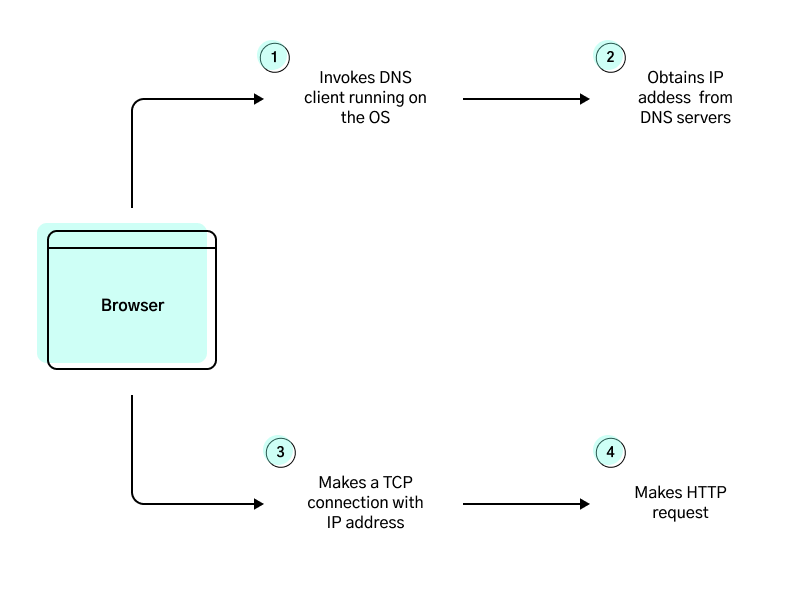
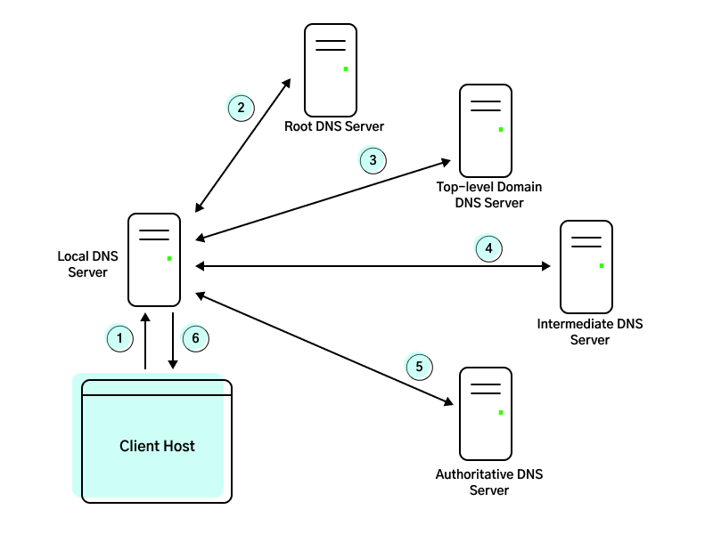

# Computer Networking: A Top Down Approach

[[toc]]

## Features of TCP and UDP

### TCP

Features:

- **Connection-oriented service**: TCP has the client and server exchange transport-layer control information with each other before the application-level messages begin to flow. This so-called handshaking procedure alerts the client and server, allowing them to prepare for an onslaught of packets. After the handshaking phase, a TCP connection is said to exist between the sockets of two processes. The connection is a full-duplex connection in that the two processes can send messages to each other over the connection at the same time. When the application finishes sending messages, it must tear down the connection.
- **Reliable data transfer service**: The communicating processes can rely on TCP to deliver all data sent without error and in the proper order. When one side of the application passes a stream of bytes into a socket, it can count on TCP to deliver the same stream of bytes to the receiving socket, with no missing or duplicate bytes.

TCP also inccludes a congestion-control mechanism, which throttles a sending process when the network is congested between sender and receiver. The congestion-control mechanism also attempts to limit each TCP connection to its fair share of network bandwith. This mechanism serves to benefit the general welfare of the Internet.

#### TCP and SSL

Neither TCP nor UDP provides any encryption—the data that the sending process passes into its socket is the same data that travels over the network to the destination process. For the purposes of security, the Internet community has developed an enhancement for TCP -- Secure Sockets Layer (SSL). SSL provides provides critical process-to-process security services, including encryption, data integrity, and end-point authentication. SSL is not a third Internet transport protocol (on the same level as TCP and UDP), but instead is an enhancement of TCP, with enhancements being implemented in the _application layer_. If an appplication wants to use the services of SSL, it needs to include SSL libraries, and utilize SSL's own socket API that is similar to TCP socket API.

When an application uses SSL, the sending process passes cleartext data to the SSL socket; SSL in the sending host then encrypts the data and passes the encrypted data to the TCP socket. The reverse happens on the receiving end.

### UDP

UDP is a no-frills, lightweight transport protocol, providing minimal services. UDP is connectionless, so there is no handshaking before the two processes start to communicate. UDP provides an unreliable data transfer service—that is, when a process sends a message into a UDP socket, UDP provides no guarantee that the message will ever reach the receiving process. Furthermore, messages that do arrive at the receiving process may arrive out of order.

UDP does not include a congestion-control mechanism, so the sending side of UDP can pump data into
the layer below (the network layer) at any rate it pleases. (Note, however, that the actual end-to-end
throughput may be less than this rate due to the limited transmission capacity of intervening links or due
to congestion).

## The Web and HTTP

### HTTP Protocol

The HTTP protocol (application layer) works on top of the TCP protocol (Transport Layer). Characteristics of TCP protocol:

- Ensures reliable data transfer
- Requires a connection to be established

Establishing a connection means that TCP protocol requires client-server to exchange transport-layer control information _before_ application level messages begin to flow. This is also known as the 'handshaking' procedure which occurs before the exchange of application messages. After a successful handshaking phase, a **TCP Connection** is said to exist between client-server. The connection is a full-duplex connection in that two applications (processes) can send messages to each other over the connection at the same time.

A HTTP request-response involves a 3-way handhake. The following shows what happens on both the HTTP and TCP layers when a user requests ofr a web page:

1. Client initiates handshaking procedure by sending a TCP segment
2. Server acknowledges receipt and responds with a TCP segment
3. Client acknowledges receipt and responds with a TCP segment (marking the end of 3-way handshake). This last acknowledgement is sent together with the HTTP request.
4. Finally, the server sends over the HTTP response with web page data.
5. The TCP connection may terminate, depending on whether the TCP connection is persisted.

The duration of entire exchange is roughly the sum of:

- 2x RTT (Round Trip Time, the time it takes for a packet to travel to server and back)
- The time it takes for server to transmit web page data

### HTTP with Persistent Connections

When an HTTP request is made for the first time, a TCP connection is first established before HTTP messages are exchanged. With persistent connections, the server leaves the TCP connection open after sending a response. Subsequent requests and responses between the same client-server can be sent over the same connection. Typically, the server closes the TCP connection when it isn't used for a certain amount of time. Persistent connections are possible in HTTP 1.1, and is the default operating mode.

HTTP/1.1 persistent connections also supports _pipelining_, which allows the client to fire requests back-to-back, without needing to wait for responses of previous requests. See also [here](https://stackoverflow.com/a/36437932/5204647) for HTTP/1.1 pipelining vs HTTP/2 multiplexing. Because HTTP/1.1 requires responses to be sent in order, it can be prone to Head of Line Blocking; but this isn't the case for HTTP/2.


### HTTP over multiple TCP Connections

In a context where pipelining/multiplexing isn't possible (in a pre-HTTP/1.1 world), a workaround to enhance performance is to open multiple TCP connections. If a user requests for 10 web objects, the browser could open multiple TCP connections and fire HTTP requests _in parallel_. This offers better performance than having to chain request-response _in series_.

### Web Caching


Web caching can be achieved with a proxy server that is ideally physically close to the client. When a client requests a web object for the first time, the request is first sent to the proxy server to check if a cached copy exists; and subsequently sends another request to the origin web server for the object. On the response trip, the proxy server caches the object (with the Last Modified timestamp) and proceeds to send the object to the client.

Any subsequent requests for the same object will simply be returned by the proxy server. After a period of time, there is a chance that the cached copy could be stale. To get around this, the proxy server could send a GET request with the following Header:

```
If-modified-since: Wed, 1 Aug 2022 09:23:28
```

This is known as a **Conditional GET Request**. If the object isn't modified since that date, the web server will simply return the following HTTP response status, with an empty response body:

```
304 Not Modified
```

## Telnet

Telnet was originally created to allow users to remotely access another host (a functionality similar to SSH) and it works over TCP. Users could do this by:

```
telnet 32.122.11.2
```

The above command will use telnet's default port 23. The command will later prompt the user to login with a username and password; and then provide access to a remote terminal. Data transmitted via Telnet isn't encrypted and is no longer widely used as a tool for remote terminal access.

We could, however, provide a port number to the command:

```
telnet 32.122.11.2 80
```

With a port number 80 provided, the command will attempt to establish a TCP connection and do nothing else (since it is not pointing to a Telnet port). This makes `telnet` a great way to test if a TCP connection can be established (e.g. if it is blocked by a firewall).

To go further, we can use `telnet` to establish a TCP connection, and _send_ data through it. In the following example, we will create a TCP connection and send a raw HTTP request:

1. Establish a TCP connection with `google.com` webserver on port 80:

```
telnet www.google.com 80
```

2. After successful TCP connection, the following will be prompted:

```
Trying 172.217.166.132...
Connected to www.google.com.
Escape character is '^]'.
```

3. We can now type in any data to be sent over TCP. Here, we will send data that conforms with HTTP request format. Specifically, we will send a HEAD request for the page root `/` and specify the `Host` header:

```
HEAD / HTTP/1.1
Host: www.google.com
# Hit enter twice to mark end of message
```

4. After sending, we will see a HTTP response returned!

```
HTTP/1.1 200 OK
Content-Type: text/html; charset=ISO-8859-1
Date: Fri, 05 Aug 2022 10:09:00 GMT
Server: gws
X-XSS-Protection: 0
X-Frame-Options: SAMEORIGIN
Transfer-Encoding: chunked
Expires: Fri, 05 Aug 2022 10:09:00 GMT
Cache-Control: private
```

## DNS

DNS is:

1. A distributed database implemented in a hierarchy of DNS Servers
2. An application layer protocol that operates on top of UDP on port 53

DNS is commonly employed by other application layer protocols (e.g. HTTP, SMTP) to translate user-supplied hostnames to IP addresses.

### DNS in Web Browsing



### DNS Services

Apart from resolving hostnames to IP addresses, DNS provides other services too:

#### Host Aliasing

A hostname can have one or more aliases. For example a hostname such as `server-1.foobar.com` can can have aliases `www.foobar.com` and `foobar.com`. DNS can be invoked to obtain the _canonical hostname_ from an alias.

#### Mail Server Aliasing

Similarly, mail server hostnames can have aliases too. This is desirable to allow companies to have consistent aliases for their website and email addresses, e.g. `www.foobar.com`, `customerservice@foobar.com`.

#### Load Balancing

Popular websites could have multiple web servers to deal with scale. In these cases, a canonical hostname could be associated with a set of IP addresses. When a DNS query is made, a DNS server would return the entire set of IP addresses and _rotate_ their ordering in each reply. The DNS client typically uses the first IP address in the set, so the rotation will help distribute load across web servers.

### DNS Query Chain



To illustrate the DNS query chain, suppose we want the IP address of `gaia.cs.umass.edu`:

1. First, the client makes a query to a Local DNS server. Typically this Local DNS server is provided by the ISP and is geographically close to the client host. This Local DNS server will act as a proxy for the subsequent DNS queries, in that it will make DNS queries _on behalf_ of the client.

2. The Local DNS server then makes a query to the Root DNS server. Taking note of the `.edu` TLD, it returns the IP addresses for TLD DNS servers responsible for `.edu`.

3. The Local DNS server again makes a query to the `.edu` TLD DNS Server. The TLD server takes note of `umass.edu`. In this example, the TLD server does not know the _authoritative_ DNS server for the hostname. "Authoritative" DNS servers are the ones that have the final IP of the hostname queried. But, it knows the address of an Intermediate DNS server that could lead us to the answer.

4. And again, a query is made to the Intermediate DNS Server (let's say it's `dns.umass.edu`). This server takes note of `cs.umass.edu`, and returns the address of a DNS server `dns.cs.umass.edu` that has our final answer. `dns.cs.umass.edu` is said to be our Authoritative DNS Server because it holds the IP of our original query `gaia.cs.umass.edu`.

5. The Local DNS makes a final query to the Authoritative DNS Server and obtains the final IP.

6. The Local DNS server returns the final IP to the client host.

There are a few things to take note from this example:

- The query sent from Client Host to Local DNS Server is said to be a **recursive query**, where the target is making queries on the behalf of the initiator. Meanwhile, subsequent queries made from the Local DNS Server to other servers are said to be **iterative** queries.
- In practice, the DNS query chain might be shorter as hostname-IP mappings are cached on Local DNS Servers.

See [here](https://www.cloudflare.com/learning/dns/dns-server-types/) for different categories of DNS servers.

### DNS Records

The DNS Servers that make up the DNS distributed database store _resource records_. Each DNS reply message carries one or more resource records. Each resource record is a 4-tuple that contains the following fields:

```
(Name, Value, Type, TTL)
```

There are 4 types of records, each outlined below. For brevity, the TTL field is discarded from the following examples.

#### Type A Record

Type A records provide the standard hostname-to-IP address mapping. As an example, `(gaia.cs.umass.edu, 32.128.99.1, A)` is a Type A record.

#### Type NS Record

Type NS records provide the _hostname_ of the next DNS server in the query chain. These records are typically present in an Intermediate DNS Server that isn't authoritative for the DNS query, but could lead the requester closer to the answer. As an example, an NS record looks like `(gaia.cs.umass.edu, dns.umass.edu, NS)`.

In these cases, the Intermediate DNS Server will also carry a Type A record of the _next_ DNS Server `(dns.umass,edu, 32.128.111.0, A)`.

#### Type CNAME Record

CNAME record enables DNS to provide us the feature of Host Aliasing. It contains the alias-hostname mapping, for example `(gaia.cs.umass.edu, server-west.bar.gaia.cs.umass.edu, CNAME)`.

#### Type MX Record

Silimar to CNAME, this record allows Mail Server aliasing. An example `(gaia.cs.umass.edu, mail.gaia.cs.umass.edu, MX)`.

### DNS Tools

We can use tools such as `nslookup` and `dig` to make DNS queries. `dig` is recommended, see [here](https://unix.stackexchange.com/a/93809).

Digging deeper into `dig`:

- See [general usage docs](https://phoenixnap.com/kb/linux-dig-command-examples)
- See how to trace DNS queries [here](https://jameshfisher.com/2017/08/10/dns-tracing/)

### Registering a Domain Name

Let's now take a look at how resource records are _added_ into the DNS database. Suppose we have a new website that is hosted on a single server through an IaaS provider such as DigitalOcean. This website needs a catchy hostname and we will give it a canonical hostname `captainspaghetti.com` without bothering with hostname aliases.

The first step is to insert a Type A record into DigitalOcean's DNS Servers. Suppose that there are 2 such servers, one acting as primary `ns1.digitalocean.com` and the other as secondary `ns2.digitalocean.com`. These DNS Servers are said to be _authoritative_ because it maps our hostname to the IP of our website host. The record would look something like `(captainspaghetti.com, <website host IP>, A)`.

The next step is to add resource records into `.com` TLD DNS Servers that will lead queries to DigitalOcean's DNS Servers. This is typically done through a Registrar (e.g. Namecheap) for a fee. The registrar will ensure that the following is added to `.com` TLD DNS Servers:

```
(captainspaghetti.com, ns1.digitalocean.com, NS)
(ns1.digitalocean.com, <IP address of ns1.digitalocean.com>, A)

# similar records will be entered for ns2.digitalocean.com
```

How a DNS query for `captainspaghetti.com` would look like:

1. DNS query is made to `.com` TLD DNS server, and the server returns both Type NS and Type A records listed above.
2. Subsequent DNS query is made to DigitalOcean's DNS Server, which contains the Type A record corresponing to `captainspaghetti.com`. The query resolves here with the IP it is looking for.

<PostDate />
<PageTags />
